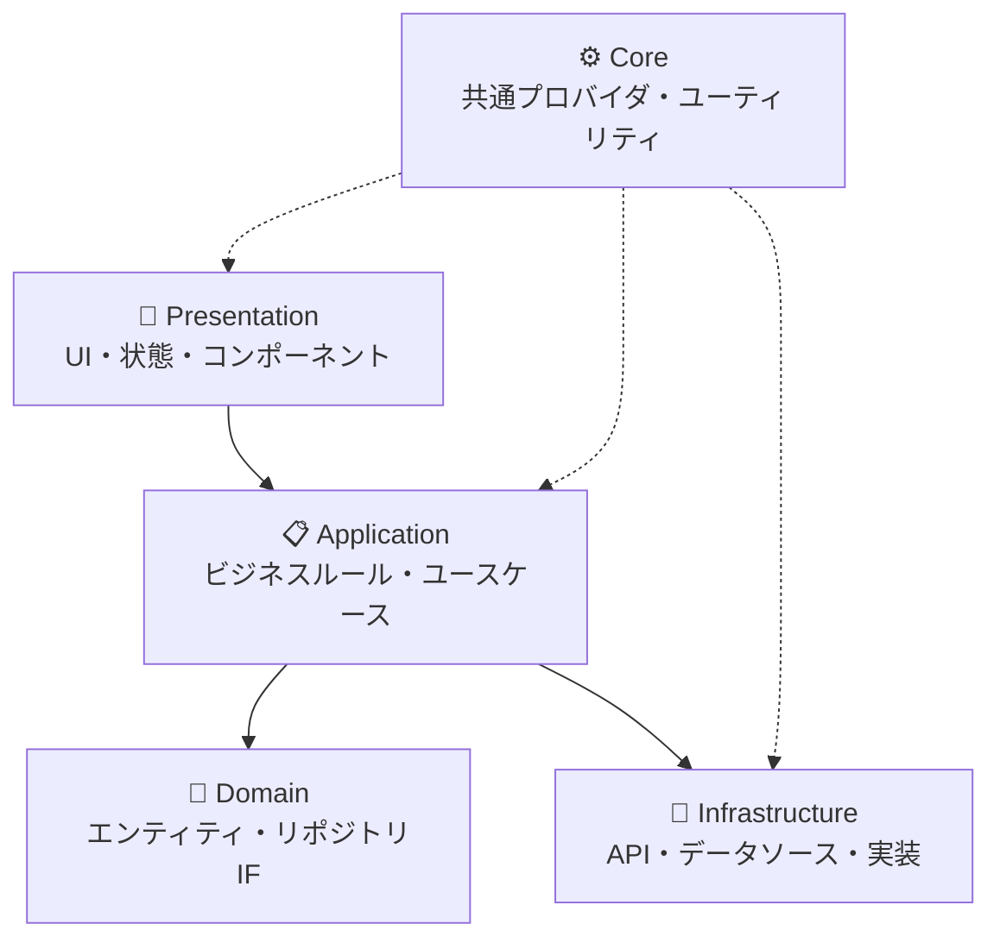
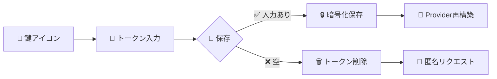
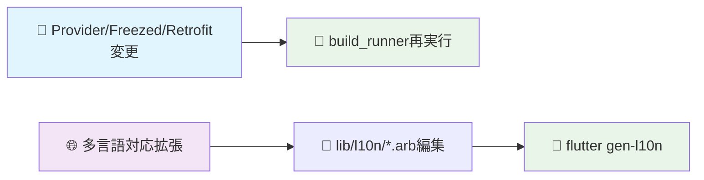

<div align="center">

# 🚀 yumemi_flutter_codecheck

<p align="center">
  
  
  
</p>

<p align="center">
  
  
</p>

---

**✨ Modern Flutter GitHub Repository Search App ✨**

このアプリは株式会社ゆめみのFlutterコーディング課題として実装した、GitHubリポジトリ検索用のデモアプリです。課題要件を満たすだけでなく、実務を想定したテストしやすいアーキテクチャとチーム開発を意識したコードベースを整備しています。

</div>

## ✨ 主な特徴

<table>
  <tr>
    <td align="center" width="50%">
      <h3>🔍 GitHub検索機能</h3>
      GitHub APIを利用したリポジトリ検索と詳細閲覧機能<br>
      <em>Retrofit + Dio</em>
    </td>
    <td align="center" width="50%">
      <h3>⚡ 状態管理</h3>
      Riverpod（Hooks対応）による<br>依存関係の明示的な注入
    </td>
  </tr>
  <tr>
    <td align="center">
      <h3>🌙 テーマ切り替え</h3>
      ダーク / ライトテーマ切り替えと<br>SharedPreferencesを用いた永続化
    </td>
    <td align="center">
      <h3>🔐 セキュリティ</h3>
      Flutter Secure Storageに保存する<br>個人アクセストークン編集ダイアログ
    </td>
  </tr>
  <tr>
    <td align="center">
      <h3>🌐 多言語対応</h3>
      日本語・英語・中国語に対応した<br>ローカライズ（<code>lib/l10n/</code>）
    </td>
    <td align="center">
      <h3>✨ リッチUI</h3>
      アニメーションを多用したリッチなUIと<br>アクセシビリティを考慮した操作感
    </td>
  </tr>
</table>

## 🏗️ アーキテクチャ設計のポイント

<div align="center">



</div>

- 🏛️ **レイヤード構造**: `domain`（純粋なビジネスルール）と`infrastructure`（API・端末機能）を分離し、依存逆転を徹底
- 🧪 **テスト容易性**: RiverpodのProvider overrideを活用し、リポジトリやデータソースをモックに差し替えてテスト可能
- 🔄 **エンティティとモデルの分離**: APIレスポンスは`infrastructure/model`で定義し、`domain/entity`へマッピングすることでUI層からの切り離しを実現
- ⚡ **コード生成の活用**: Freezed / Retrofit / Riverpodのジェネレートコードにより、イミュータブルなデータと型安全なAPIクライアントを提供
- 🛤️ **ナビゲーション**: AutoRouteで画面遷移を集中管理し、テストやリファクタリング時の影響範囲を限定

## 📁 ディレクトリ構成

<div>

```
📦 lib/
├── 📋 application/← ルーター、テーマ、フレーバー設定
├── ⚙️ core/← 共通プロバイダ・ユーティリティ
├── 🎯 domain/← エンティティとリポジトリインターフェース
├── 🔧 infrastructure/← APIクライアント・モデル・リポジトリ実装
├── 🎨 presentation/← UI、状態、コンポーネント
└── 🌐 l10n/← ローカライズファイル

📦 test/               ← テストコード (lib/と同じ構造)
├── 🧪 infrastructure/
├── 🧪 core/
└── 🧪 presentation/
```

</div>

> 💡 テストコードは`test/`配下に同じ構造で配置し、インフラ層・プロバイダの振る舞いを検証しています。

## 🚀 セットアップ手順

<details>
<summary><strong>📱 1. 環境を整備</strong></summary>

Flutter: 3.35.3
Android Studio: Android Studio Ladybug Feature Drop
XCode: 16.2

</details>

<details>
<summary><strong>📦 2. 依存関係の取得</strong></summary>

```bash
flutter pub get
```
</details>

<details>
<summary><strong>⚡ 3. コード生成</strong></summary>

初回および該当ファイル変更時：
```bash
flutter pub run build_runner build --delete-conflicting-outputs
```
</details>

<details>
<summary><strong>🌐 4. ローカライズ更新</strong></summary>

多言語対応ファイルを更新した場合：
```bash
flutter gen-l10n
```
</details>

## 🏃‍♂️ 実行方法

<div align="center">

| 🚀 実行タイプ | 📱 コマンド | 📝 説明 |
|:---:|:---|:---|
| **🔧 開発** | `flutter run --flavor dev` | 開発用フレーバー |
| **🌟 本番** | `flutter run --flavor prod --release` | 本番用フレーバー |
| **🤖 Android** | `flutter build apk --flavor prod` | Android APK ビルド |
| **🍎 iOS** | `flutter build ios --flavor prod --release` | iOS ビルド |

</div>

## 🔐 GitHubトークンの設定

<div align="center">



</div>

1. **🔑 アクセス**: 右上の鍵アイコンをタップしてダイアログを表示
2. **💾 保存**: 個人アクセストークン（PAT）を入力して保存すると、`FlutterSecureStorage`に暗号化されて永続化
3. **🗑️ 削除**: 未入力のまま保存するとトークンは削除され、匿名リクエストとして実行
4. **🔄 更新**: トークン変更後はRiverpodの`Provider`を再構築し、UIに反映

## 🧪 テストと品質管理

<table align="center">
  <tr>
    <th>🧪 テストタイプ</th>
    <th>📋 コマンド</th>
    <th>📝 説明</th>
  </tr>
  <tr>
    <td align="center"><strong>ユニットテスト</strong></td>
    <td><code>flutter test -r expanded</code></td>
    <td>
      • <code>test/infrastructure/repository/</code>: GitHub APIクライアントのモック検証<br>
      • <code>test/infrastructure/repository/*_provider_test.dart</code>: Riverpod override テスト
    </td>
  </tr>
  <tr>
    <td align="center"><strong>静的解析</strong></td>
    <td><code>flutter analyze</code></td>
    <td>コード品質と潜在的な問題を検出</td>
  </tr>
  <tr>
    <td align="center"><strong>フォーマッタ</strong></td>
    <td><code>dart format --set-exit-if-changed .</code></td>
    <td>CI準拠のコードフォーマット</td>
  </tr>
</table>

## ⚡ コード生成とメンテナンス

<div align="center">



</div>

> ⚠️ **重要な注意事項**
> - Provider / Freezed / Retrofitを追加・変更した際は、必ず`build_runner`を再実行
> - 生成ファイル（`*.g.dart`, `*.freezed.dart`）は**手動で編集禁止**
> - 多言語対応拡張時は`lib/l10n/*.arb`を編集し、`flutter gen-l10n`を再実行

## 💭 開発で意識したこと

<div align="center">

| 🎯 重点項目 | 📝 取り組み内容 | 🚀 効果 |
|:---:|:---|:---|
| **🏗️ アーキテクチャ** | UI/状態/データアクセスを明確に分離 | 保守・拡張性の向上 |
| **🔧 依存性注入** | Providerを細かく分割し統一 | テストでの差し替えが容易 |
| **📱 端末機能** | SharedPreferences/SecureStorageを抽象化 | モックテストで副作用を最小化 |
| **🎨 UI/UX** | 自作AppColors拡張とアニメーション | テーマ切り替え時の体験向上 |

</div>

## 📄 ライセンス / 注意事項

<div align="center">

> 🏢 **株式会社ゆめみ コーディング課題提出物**

</div>

<table align="center">
  <tr>
    <td align="center">⚠️</td>
    <td><strong>GitHub API利用時の注意</strong><br>レート制限や利用規約に従ってください</td>
  </tr>
  <tr>
    <td align="center">🔐</td>
    <td><strong>アクセストークンの取り扱い</strong><br>セキュリティに十分ご注意ください</td>
  </tr>
</table>

---

<div align="center">

**🎉 Thank you for reviewing! 🎉**

上記を参考に、レビューや拡張を行っていただければ幸いです。

<p>
  
  
</p>

</div>
